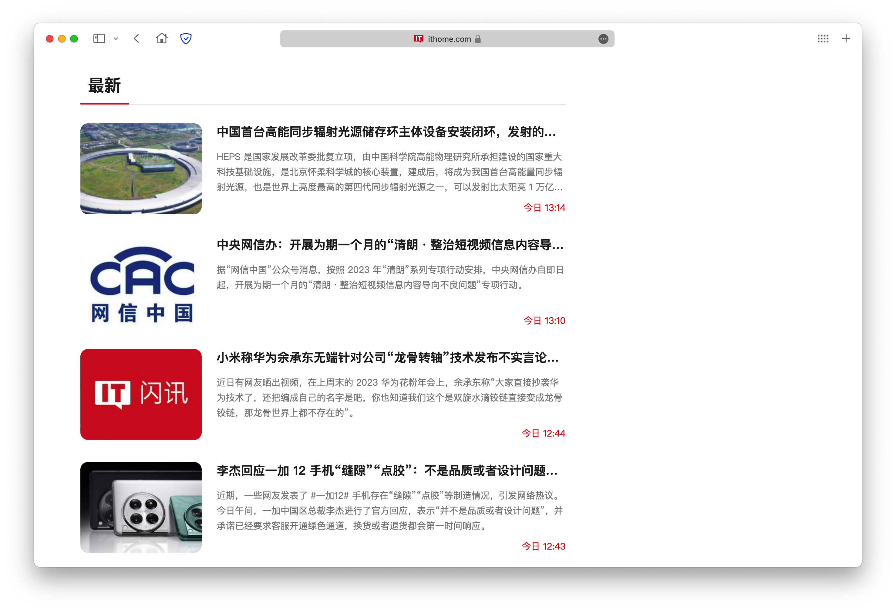

# IThome-Fix

* 去除博客版信息流广告
* 限制图片宽度及添加圆角

IT之家博客版：https://www.ithome.com/blog/  
建议搭配 AdGuard 使用



Just manually created ......

```
// ==UserScript==
// @name         IThome Fix
// @namespace    http://your-namespace.com
// @version      1.0
// @description  去除「IT之家」博客版信息流广告
// @author       https://blog.tongmingzhi.com
// @match        https://www.ithome.com/*
// @grant        none
// ==/UserScript==

(function() {
    'use strict';

    // Function to set rounded images with proportional height
    function setRoundedImages() {
        var images = document.querySelectorAll('img');
        images.forEach(function(image) {
            image.style.borderRadius = '10px';
            image.style.maxWidth = '400px';
            image.style.height = 'auto';
        });
    }

    // Function to remove ads
    function removeAds() {
        document.querySelectorAll('div.bb.clearfix > div.fl > ul.bl > li').forEach(function(element) {
            if (element.querySelector('div.c > div.m:empty')) {
                element.remove();
            }
        });
    }

    // Wait for the page to fully load
    window.addEventListener('load', function() {
        // Execute both functions
        setRoundedImages();
        removeAds();
    });
})();
```
